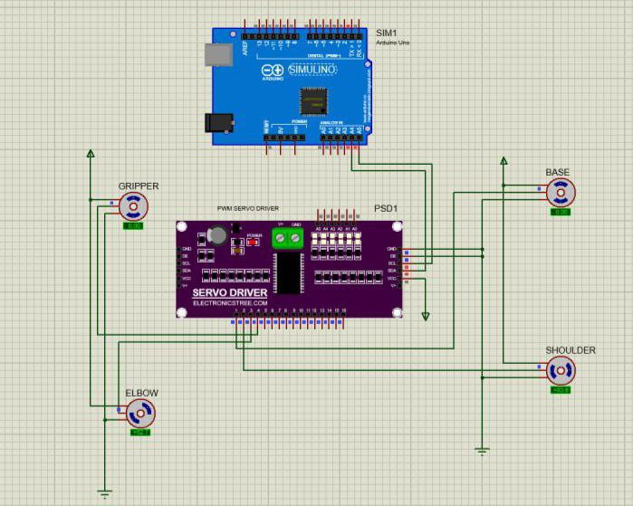

# 🤖 4-DOF MeArm Robotic Arm

This project showcases a **4-DOF robotic arm** built using the **MeArm kit**, designed to perform **pick-and-place operations**.  
The system integrates **Arduino Uno, PCA9685 PWM driver, SG90 servo motors**, and a **DC-DC buck converter** for safe power management.  
Additionally, **MATLAB** was used for kinematic modeling, trajectory simulation, and workspace analysis, while **Proteus** was used for circuit simulation.  

---

## 🏗️ System Overview
The robotic arm system consists of three main parts:  
1. **Hardware** → MeArm structure + Arduino Uno + PCA9685 + Servos + Power Supply  
2. **Simulation** → MATLAB used for kinematics and trajectory analysis  
3. **Circuit Validation** → Proteus used to test electronic connections  

📌 *System diagram goes here (add image to `/Images`)*  

---

## ✨ Features
- 🔧 **MeArm 4-DOF Kit** used as mechanical structure  
- 🎛 **Arduino Uno + PCA9685** for multi-servo control  
- ⚡ **DC-DC buck converter** for safe power supply (12V → 5V)  
- 📐 **MATLAB simulations** for forward/inverse kinematics & trajectory planning  
- 💻 **Proteus circuit simulation** for safe circuit validation  
- 🤖 Capable of **smooth, repeatable pick-and-place tasks**  

---

## 🛠 Hardware Components

| Component              | Description                       |
|-------------------------|-----------------------------------|
| **MeArm Kit (4-DOF)**  | Pre-built acrylic structure       |
| **4× SG90 Servo Motors** | For joint actuation              |
| **Arduino Uno**        | Microcontroller board             |
| **PCA9685 PWM Driver** | 16-channel PWM controller         |
| **DC-DC Buck Converter** | Converts 12V input to 5V servos  |
| **12V Battery/Adapter** | Power source                     |
| **Breadboard & Wires** | For prototyping and connections   |

---

## ⚡ Wiring Overview
- Servo Motors → PCA9685 outputs (channels 0–3)  
- PCA9685 → Arduino Uno via **I2C** (A4 = SDA, A5 = SCL)  
- PCA9685 V+ → Powered by **DC-DC buck converter** output (5V)  
- DC-DC Input → External **12V battery/adapter**  
- Common Ground → Shared between **Arduino, PCA9685, and power supply**  

📌 *Wiring diagram image goes here (add to `/Images`)*  

---

## 📐 MATLAB Analysis
- Defined **DH parameters** for forward & inverse kinematics  
- Visualized **joint positions** and **end-effector trajectories**  
- Simulated **workspace volume** and feasible motions  
- Implemented **PD computed torque control** for smooth trajectory tracking  

---

## 📸 Project Gallery

### Robot Full View

### MATLAB Circuit Simulation

